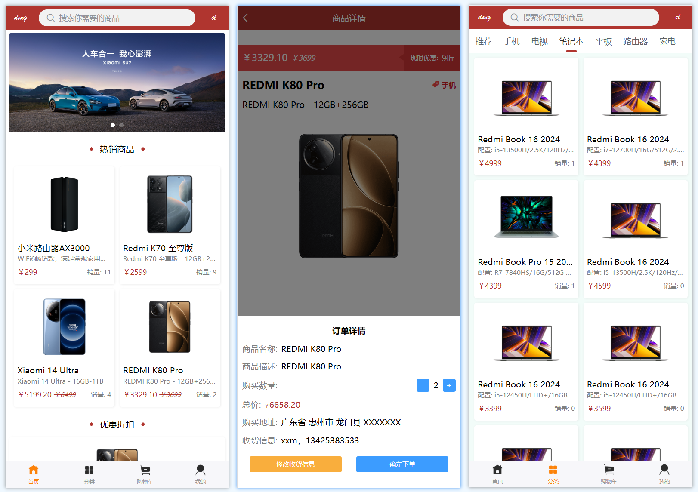
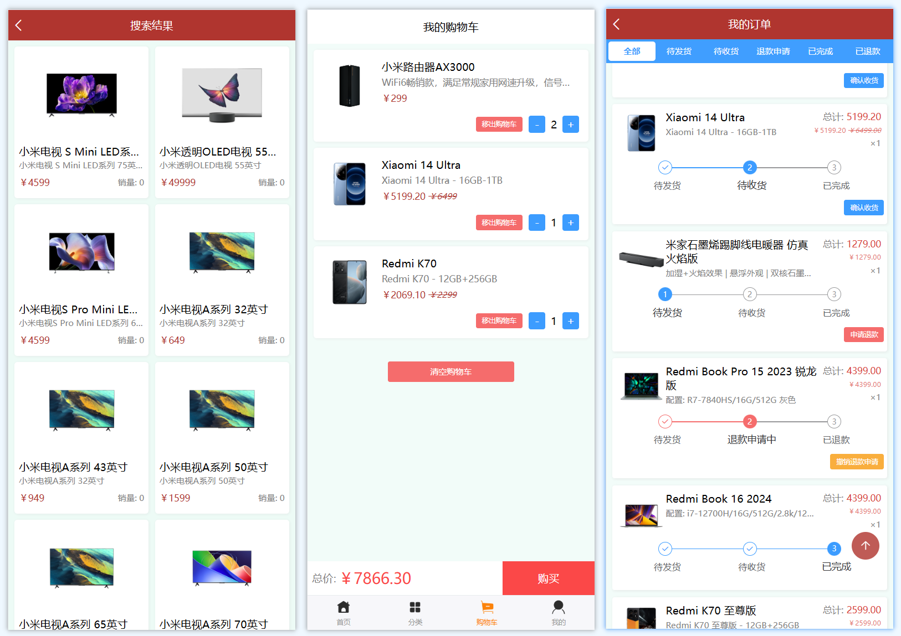
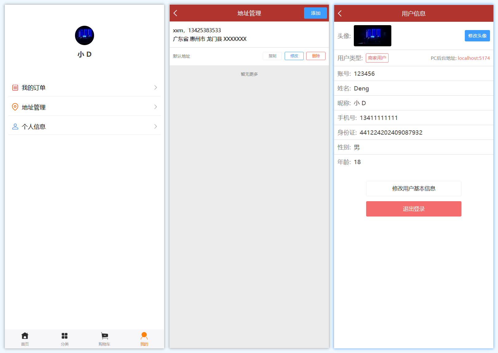

# vue3 项目客户端前台（uniapp）

**后台管理系统**: [cms-back-management_vue3](https://github.com/deng-cl/cms-back-management_vue3)

**Node 后端接口**: [cms-node_koa](https://github.com/deng-cl/cms-node_koa)

下面是项目中部分页面的截图

